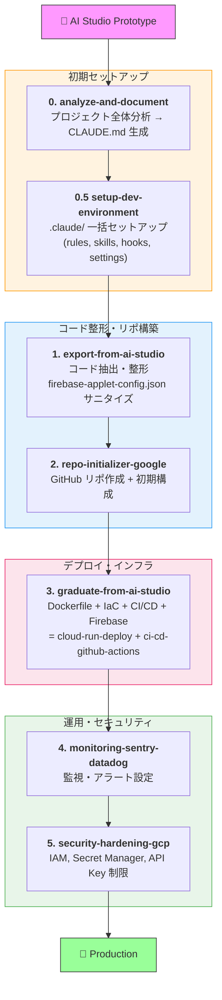

# Google AI Studio to Production Skills

Google AI Studio のプロトタイプを本番環境に持っていくための Claude Code スキル集。

## Overview

Google AI Studio は Gemini モデルを使った高速プロトタイピングに最適ですが、「プレイグラウンドで動く」から「本番で安定稼働する」までには、プロジェクト分析・コード整形・インフラ構築・CI/CD・監視・セキュリティが必要です。これらをスキルで自動化します。

## Skills

### 初期セットアップ（Step 0）

| Skill | Description | Trigger Examples |
|-------|-------------|------------------|
| **[analyze-and-document](skills/analyze-and-document/)** | プロジェクト全体分析 → CLAUDE.md 生成（最初にやるべきこと） | "プロジェクト分析して", "CLAUDE.md作って", "analyze this project" |
| **[setup-dev-environment](skills/setup-dev-environment/)** | `.claude/` ディレクトリを一括セットアップ（rules, skills, settings, hooks） | "開発環境セットアップして", "setup dev environment", ".claude設定して" |

`setup-dev-environment` は以下を**必須**でインストールします:

- `.claude/rules/` — セキュリティ、Firebase、コーディングルール
- `.claude/skills/` — ローカル開発サーバー操作、Firestore 管理
- `.claude/hooks/prevent-api-key-commit.sh` — API Key のハードコードをブロック
- `.claude/settings.json` — パーミッション + API Key 防止 hook

さらに、以下を**オプション**で追加できます:

| Option | 内容 |
|--------|------|
| **Agents** | コードレビュー + セキュリティ監査エージェント |
| **Hooks (追加)** | prettier / biome フォーマッター自動実行 |
| **MCP** | Firebase Emulator 連携 |

### コード整形・リポジトリ構築

| Skill | Description | Trigger Examples |
|-------|-------------|------------------|
| [export-from-ai-studio](skills/export-from-ai-studio/) | AI Studio エクスポートのコード抽出・整形・API Key サニタイズ | "AI Studioからコード持ってきて", "export my AI Studio project" |
| [repo-initializer-google](skills/repo-initializer-google/) | GitHub リポ作成 + .gitignore / README / GCP 向け初期構成 | "リポジトリ作って", "set up a new repo for my Gemini app" |

### デプロイ・インフラ

| Skill | Description | Trigger Examples |
|-------|-------------|------------------|
| **[graduate-from-ai-studio](skills/graduate-from-ai-studio/)** | 一括卒業: Dockerfile + IaC + CI/CD + Firebase 設定を一括生成 | "AI Studioから卒業", "make this independently deployable" |
| [cloud-run-deploy](skills/cloud-run-deploy/) | Google Cloud Run へのデプロイ（Secret Manager, IAM 込み） | "Cloud Runにデプロイして", "deploy this to Cloud Run" |
| [vercel-railway-deploy](skills/vercel-railway-deploy/) | Vercel / Railway へのデプロイ | "Vercelにデプロイ", "deploy to Railway" |
| [ci-cd-github-actions](skills/ci-cd-github-actions/) | GitHub Actions CI/CD パイプライン構築 | "CI/CD設定して", "add GitHub Actions" |

> **Note:** `graduate-from-ai-studio` は `cloud-run-deploy` と `ci-cd-github-actions` の機能を統合しています。個別のスキルは単体でも利用可能です。

### 運用・セキュリティ

| Skill | Description | Trigger Examples |
|-------|-------------|------------------|
| [monitoring-sentry-datadog](skills/monitoring-sentry-datadog/) | Sentry / Datadog による監視・エラートラッキング | "監視入れて", "add error tracking", "set up monitoring" |
| [security-hardening-gcp](skills/security-hardening-gcp/) | GCP セキュリティ強化（IAM, Secret Manager, API Key 制限） | "セキュリティ設定して", "secure my GCP deployment" |

## Typical Workflow



各スキルは単体でも利用可能です。ワークフロー全体を通す必要はありません。

## Security

AI Studio が生成するプロジェクトには以下のセキュリティ上の注意点があります:

- **`firebase-applet-config.json` に平文 API Key** — `export-from-ai-studio` で環境変数に外出し、`setup-dev-environment` の hook でコミット防止
- **Gemini API Key がハードコードされる場合がある** — Secret Manager へ移行
- **Firebase Web API Key に利用制限なし** — Google Cloud Console でリファラー制限を設定

詳細は [security-hardening-gcp](skills/security-hardening-gcp/) スキルを参照。

## Documentation

- [AI Studio が生成するプロジェクトの構造](docs/ai-studio-project-anatomy.md) — スキルが前提とする共通パターン
- [graduate スキルの設計判断](docs/graduate-skill-design-decisions.md) — 設計時の判断理由の記録

## Installation

### Via Plugin Marketplace (recommended)

```bash
# 1. マーケットプレイスとして登録
/plugin marketplace add --source github:TakuroFukamizu/google-ai-studio-to-prod-skills

# 2. プラグインをインストール
/plugin install google-ai-studio-to-prod@google-ai-studio-to-prod-skills
```

### Via `npx skills` CLI

```bash
# Install all skills
npx skills add TakuroFukamizu/google-ai-studio-to-prod-skills

# Install a specific skill only
npx skills add TakuroFukamizu/google-ai-studio-to-prod-skills --skill graduate-from-ai-studio

# For Claude Code specifically
npx skills add TakuroFukamizu/google-ai-studio-to-prod-skills -a claude-code -y
```

### Via Claude Code `/install` command

```
/install TakuroFukamizu/google-ai-studio-to-prod-skills
```

### Manual (clone and reference locally)

```bash
git clone https://github.com/TakuroFukamizu/google-ai-studio-to-prod-skills.git
```

## Update

インストール方法によって更新手順が異なります:

| インストール方法 | 更新コマンド |
|----------------|-------------|
| Plugin Marketplace | `/plugin marketplace update google-ai-studio-to-prod-skills` |
| `npx skills` | `npx skills add TakuroFukamizu/google-ai-studio-to-prod-skills`（再インストール） |
| `/install` | `/install TakuroFukamizu/google-ai-studio-to-prod-skills`（再インストール） |
| Manual clone | `git pull origin main` → `/reload-plugins` またはセッション再起動 |

## Requirements

- Claude Code CLI
- Google Cloud SDK (`gcloud`) — GCP 関連スキルに必要
- GitHub CLI (`gh`) — リポ初期化・CI/CD に必要
- Node.js 18+ or Python 3.11+ — AI Studio エクスポートに依存

## License

See [LICENSE](LICENSE) for details.
