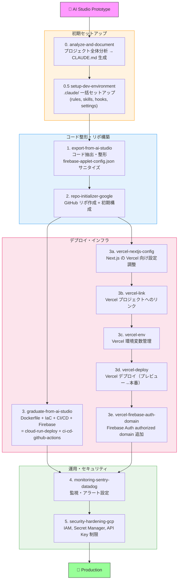

# Google AI Studio to Production Skills

Google AI Studio のプロトタイプを本番環境に持っていくための Claude Code スキル集。

## Overview

Google AI Studio は Gemini モデルを使った高速プロトタイピングに最適ですが、「プレイグラウンドで動く」から「本番で安定稼働する」までには、プロジェクト分析・コード整形・インフラ構築・CI/CD・監視・セキュリティが必要です。これらをスキルで自動化します。デプロイ先として **Google Cloud Run** と **Vercel** の両方に対応しています。

## Skills

### ワンパスマイグレーション

| Skill | Description | Trigger Examples |
|-------|-------------|------------------|
| **[migrate-wizard](skills/migrate-wizard/)** | 全ステップをワンパスで実行するウィザード。自動検出 → 一括質問 → 順次実行 | "本番に移行して", "migrate to production", "ワンパスでマイグレーション" |

> **初めての方はこれだけで OK。** 完了済みステップは自動スキップ、途中参加も可能です。Cloud Run / Vercel 対応。

### 初期セットアップ（Step 0）

| Skill | Description | Trigger Examples |
|-------|-------------|------------------|
| **[analyze-and-document](skills/analyze-and-document/)** | プロジェクト全体分析 → CLAUDE.md 生成（最初にやるべきこと） | "プロジェクト分析して", "CLAUDE.md作って", "analyze this project" |
| **[setup-dev-environment](skills/setup-dev-environment/)** | `.claude/` ディレクトリを一括セットアップ（rules, skills, settings, hooks） | "開発環境セットアップして", "setup dev environment", ".claude設定して" |

`setup-dev-environment` は以下を**必須**でインストールします:

- `.claude/rules/` — セキュリティ、Firebase、コーディングルール
- `.claude/skills/` — ローカル開発サーバー操作、Firestore 管理
- `.claude/hooks/prevent-api-key-commit.sh` — API Key のハードコードをブロック
- `.claude/settings.json` — パーミッション + API Key 防止 hook

さらに、以下を**オプション**で追加できます:

| Option | 内容 |
|--------|------|
| **Agents** | コードレビュー + セキュリティ監査エージェント |
| **Hooks (追加)** | prettier / biome フォーマッター自動実行 |
| **MCP** | Firebase Emulator 連携 |

### コード整形・リポジトリ構築

| Skill | Description | Trigger Examples |
|-------|-------------|------------------|
| [export-from-ai-studio](skills/export-from-ai-studio/) | AI Studio エクスポートのコード抽出・整形・API Key サニタイズ | "AI Studioからコード持ってきて", "export my AI Studio project" |
| [repo-initializer-google](skills/repo-initializer-google/) | GitHub リポ作成 + .gitignore / README / GCP 向け初期構成 | "リポジトリ作って", "set up a new repo for my Gemini app" |

### デプロイ・インフラ

| Skill | Description | Trigger Examples |
|-------|-------------|------------------|
| **[graduate-from-ai-studio](skills/graduate-from-ai-studio/)** | 一括卒業: Dockerfile + IaC + CI/CD + Firebase 設定を一括生成 | "AI Studioから卒業", "make this independently deployable" |
| [cloud-run-deploy](skills/cloud-run-deploy/) | Google Cloud Run へのデプロイ（Secret Manager, IAM 込み） | "Cloud Runにデプロイして", "deploy this to Cloud Run" |
| [vercel-railway-deploy](skills/vercel-railway-deploy/) | Vercel / Railway へのデプロイ | "Vercelにデプロイ", "deploy to Railway" |
| [ci-cd-github-actions](skills/ci-cd-github-actions/) | GitHub Actions CI/CD パイプライン構築 | "CI/CD設定して", "add GitHub Actions" |

> **Note:** `graduate-from-ai-studio` は `cloud-run-deploy` と `ci-cd-github-actions` の機能を統合しています。個別のスキルは単体でも利用可能です。

#### Vercel デプロイ

| Skill | Description | Trigger Examples |
|-------|-------------|------------------|
| [vercel-ai-studio-export](skills/vercel-ai-studio-export/) | AI Studio エクスポートの構造ナレッジ | — (migrate-wizard から自動参照) |
| [vercel-gcp-project-identification](skills/vercel-gcp-project-identification/) | GCP プロジェクト特定ナレッジ | — (migrate-wizard から自動参照) |
| [vercel-nextjs-config](skills/vercel-nextjs-config/) | Next.js の Vercel 向け設定調整 | "Vercel用にnext.config直して", "fix next config for Vercel" |
| [vercel-link](skills/vercel-link/) | Vercel プロジェクトへのリンク | "Vercelにリンクして", "vercel link" |
| [vercel-env](skills/vercel-env/) | Vercel 環境変数管理 | "Vercel環境変数設定して", "set Vercel env" |
| [vercel-deploy](skills/vercel-deploy/) | Vercel デプロイ（プレビュー→本番） | "Vercelにデプロイ", "deploy to Vercel" |
| [vercel-firebase-auth-domain](skills/vercel-firebase-auth-domain/) | Firebase Auth authorized domain 追加 | "Firebase認証ドメイン追加", "add auth domain" |

> `migrate-wizard` が Vercel パスを選択した場合、これらのスキルは自動的にオーケストレーションされます。

### 運用・セキュリティ

| Skill | Description | Trigger Examples |
|-------|-------------|------------------|
| [monitoring-sentry-datadog](skills/monitoring-sentry-datadog/) | Sentry / Datadog による監視・エラートラッキング | "監視入れて", "add error tracking", "set up monitoring" |
| [security-hardening-gcp](skills/security-hardening-gcp/) | GCP セキュリティ強化（IAM, Secret Manager, API Key 制限） | "セキュリティ設定して", "secure my GCP deployment" |

## Typical Workflow



各スキルは単体でも利用可能です。ワークフロー全体を通す必要はありません。

## Security

AI Studio が生成するプロジェクトには以下のセキュリティ上の注意点があります:

- **`firebase-applet-config.json` に平文 API Key** — `export-from-ai-studio` で環境変数に外出し、`setup-dev-environment` の hook でコミット防止
- **Gemini API Key がハードコードされる場合がある** — Secret Manager へ移行
- **Firebase Web API Key に利用制限なし** — Google Cloud Console でリファラー制限を設定

詳細は [security-hardening-gcp](skills/security-hardening-gcp/) スキルを参照。

## Deploy Guide

AI Studio では「Publish」ボタン1つでデプロイできましたが、卒業後は自分のインフラにデプロイします。

### スキルを使ってデプロイ（推奨）

Claude Code にお任せする方法です。スキルがインフラ構築からデプロイまでをガイドします。

**まだ移行していない場合（初回）:**

```
# これだけで OK — 分析からデプロイ設定まで全自動
「本番に移行して」 or 「migrate to production」
→ migrate-wizard が起動し、全ステップを順番に実行
```

**既に移行済みで、デプロイだけしたい場合:**

```
# Cloud Run にデプロイ
「Cloud Runにデプロイして」 or 「deploy to Cloud Run」
→ cloud-run-deploy スキルが起動

# Vercel にデプロイ
「Vercelにデプロイ」 or 「deploy to Vercel」
→ vercel-deploy スキルが起動（vercel-link, vercel-env 等も個別利用可）

# CI/CD パイプラインを追加・修正
「CI/CD設定して」 or 「add GitHub Actions」
→ ci-cd-github-actions スキルが起動
```

> **Tip:** スキルは対話的に質問しながら進めるので、GCP の知識がなくても大丈夫です。

### スキルを使わずにデプロイ（手動）

`migrate-wizard` または `graduate-from-ai-studio` を実行済みであれば、CI/CD パイプラインと IaC が生成されています。以下の手順で手動デプロイできます。

### GCP / Cloud Run

#### 初回セットアップ（方法 A / B 共通）

`migrate-wizard` 完了時の「手動作業」リストに沿って進めます:

```bash
# 1. GCP プロジェクト作成（新規プロジェクトの場合）
gcloud projects create YOUR_PROJECT_ID
gcloud config set project YOUR_PROJECT_ID
firebase projects:addfirebase YOUR_PROJECT_ID

# 2. IaC でインフラ構築（Cloud Run, Artifact Registry, IAM, Secret Manager）
# Terraform の場合:
cd infra/terraform && terraform init && terraform plan && terraform apply

# Pulumi の場合:
cd infra/pulumi && npm install && pulumi up

# CLI スクリプトの場合:
bash infra/scripts/setup.sh

# 3. Firestore ルール・インデックスのデプロイ
firebase deploy --only firestore
```

初回セットアップが完了したら、以下の **A** または **B** いずれかの方法でデプロイします。

#### 方法 A: CI/CD 自動デプロイ（推奨）

> **`git push` = AI Studio の「Publish」ボタン。** main に push するだけで自動デプロイされます。

**初回のみ追加で必要な設定:**

```bash
# Workload Identity Federation 設定（GitHub Actions → GCP の認証）
# 詳細: https://github.com/google-github-actions/auth#workload-identity-federation

# GitHub Secrets 設定
gh secret set WIF_PROVIDER --body "projects/PROJECT_NUMBER/locations/global/workloadIdentityPools/POOL/providers/PROVIDER"
gh secret set WIF_SERVICE_ACCOUNT --body "SA_NAME@PROJECT_ID.iam.gserviceaccount.com"
gh secret set GCP_PROJECT_ID --body "YOUR_PROJECT_ID"
```

**デプロイ（初回も2回目以降も同じ）:**

```bash
git add .
git commit -m "Update feature X"
git push origin main
```

GitHub Actions (`.github/workflows/deploy.yml`) が自動で以下を実行します:

1. Docker イメージをビルド
2. Artifact Registry に push
3. Cloud Run サービスを更新
4. Firestore ルール・インデックスをデプロイ

#### 方法 B: 手動デプロイ

> GitHub Actions を使わず、ローカルから直接デプロイする方法。CI/CD の設定が不要で手軽ですが、毎回手動実行が必要です。

```bash
# Cloud Run に直接デプロイ
gcloud run deploy SERVICE_NAME --source . --region asia-northeast1

# Firestore ルールのデプロイ
firebase deploy --only firestore:rules

# Firestore インデックスのデプロイ
firebase deploy --only firestore:indexes
```

#### デプロイの確認（A / B 共通）

```bash
# Cloud Run サービスの URL を確認
gcloud run services describe SERVICE_NAME --region asia-northeast1 --format='value(status.url)'

# ログを確認
gcloud run services logs read SERVICE_NAME --region asia-northeast1 --limit 50

# ヘルスチェック
curl https://YOUR_SERVICE_URL/health
```

### Vercel

`migrate-wizard` で Vercel パスを選択済み、または個別の Vercel スキルを実行済みであれば、`vercel.json` と Next.js 設定が生成されています。以下の手順で手動デプロイできます。

#### 初回セットアップ

```bash
# 1. Vercel CLI インストール（未インストールの場合）
npm i -g vercel

# 2. Vercel にログイン
vercel login

# 3. プロジェクトをリンク（--project と --scope を明示指定）
vercel link --yes --project YOUR_PROJECT_NAME --scope YOUR_SCOPE

# 4. 環境変数を設定
echo "YOUR_GEMINI_API_KEY" | vercel env add GEMINI_API_KEY production
echo "YOUR_GEMINI_API_KEY" | vercel env add GEMINI_API_KEY preview
echo "YOUR_GEMINI_API_KEY" | vercel env add GEMINI_API_KEY development

# Firebase 設定（NEXT_PUBLIC_ はクライアントに公開される）
vercel env add NEXT_PUBLIC_FIREBASE_API_KEY production
vercel env add NEXT_PUBLIC_FIREBASE_AUTH_DOMAIN production
vercel env add NEXT_PUBLIC_FIREBASE_PROJECT_ID production

# 5. ローカル用の .env.local を取得
vercel env pull .env.local
```

#### 方法 A: Git 連携自動デプロイ（推奨）

> **`git push` = AI Studio の「Publish」ボタン。** main に push するだけで自動デプロイされます。

**初回のみ: Vercel Dashboard で Git 連携を設定**

1. [Vercel Dashboard](https://vercel.com) → プロジェクト → Settings → Git
2. GitHub リポジトリを接続
3. Production Branch を `main` に設定

**デプロイ（初回も2回目以降も同じ）:**

```bash
git add .
git commit -m "Update feature X"
git push origin main
```

Vercel が自動で以下を実行します:

1. Next.js プロジェクトをビルド
2. Edge Network にデプロイ
3. プレビュー URL を PR コメントに投稿（PR の場合）

#### 方法 B: CLI 手動デプロイ

> Git 連携を使わず、ローカルから直接デプロイする方法。ワークツリーからも直接デプロイできます。

```bash
# プレビューデプロイ（動作確認用）
vercel deploy

# 本番デプロイ
vercel deploy --prod
```

#### デプロイ後: Firebase Auth 認可ドメイン追加

Firebase Authentication（`signInWithPopup` / `signInWithRedirect`）を使っている場合、Vercel のドメインを Firebase Auth の承認済みドメインに追加しないと `auth/unauthorized-domain` エラーになります。

```bash
# GCP プロジェクト ID を特定（firebase-applet-config.json から取得）
PROJECT_ID=$(jq -r '.projectId' firebase-applet-config.json)

# 現在の承認済みドメインを取得
ACCESS_TOKEN=$(gcloud auth print-access-token)
curl -s -H "Authorization: Bearer $ACCESS_TOKEN" \
  "https://identitytoolkit.googleapis.com/admin/v2/projects/${PROJECT_ID}/config" \
  | jq '.authorizedDomains'

# Vercel ドメインを追加
CURRENT=$(curl -s -H "Authorization: Bearer $ACCESS_TOKEN" \
  "https://identitytoolkit.googleapis.com/admin/v2/projects/${PROJECT_ID}/config" \
  | jq '.authorizedDomains')
NEW_DOMAINS=$(echo "$CURRENT" | jq '. + ["YOUR_PROJECT.vercel.app"]')
curl -s -X PATCH -H "Authorization: Bearer $ACCESS_TOKEN" \
  -H "Content-Type: application/json" \
  "https://identitytoolkit.googleapis.com/admin/v2/projects/${PROJECT_ID}/config?updateMask=authorizedDomains" \
  -d "{\"authorizedDomains\": $NEW_DOMAINS}"

```

#### デプロイ後: Firestore ルール・インデックス

```bash
# Firestore ルールのデプロイ（Firebase CLI 必要）
firebase deploy --only firestore --project $PROJECT_ID
```

#### デプロイの確認

```bash
# 本番 URL を確認
vercel ls

# 環境変数の確認
vercel env ls

# ビルドログの確認（直近のデプロイ）
vercel logs YOUR_PROJECT.vercel.app

# ヘルスチェック
curl https://YOUR_PROJECT.vercel.app
```

#### カスタムドメイン設定（任意）

```bash
# CLI でドメイン追加
vercel domains add your-custom-domain.com

# または Vercel Dashboard → Project → Settings → Domains
```

> **Note:** カスタムドメインを追加した場合、Firebase Auth の承認済みドメインにもそのドメインを追加してください。

## Documentation

- [AI Studio が生成するプロジェクトの構造](docs/ai-studio-project-anatomy.md) — スキルが前提とする共通パターン
- [graduate スキルの設計判断](docs/graduate-skill-design-decisions.md) — 設計時の判断理由の記録

## Installation

### Via Plugin Marketplace (recommended)

```bash
# 1. マーケットプレイスとして登録
/plugin marketplace add --source github:TakuroFukamizu/google-ai-studio-to-prod-skills

# 2. プラグインをインストール
/plugin install google-ai-studio-to-prod@google-ai-studio-to-prod-skills
```

### Via `npx skills` CLI

```bash
# Install all skills
npx skills add TakuroFukamizu/google-ai-studio-to-prod-skills

# Install a specific skill only
npx skills add TakuroFukamizu/google-ai-studio-to-prod-skills --skill graduate-from-ai-studio

# For Claude Code specifically
npx skills add TakuroFukamizu/google-ai-studio-to-prod-skills -a claude-code -y
```

### Via Claude Code `/install` command

```
/install TakuroFukamizu/google-ai-studio-to-prod-skills
```

### Manual (clone and reference locally)

```bash
git clone https://github.com/TakuroFukamizu/google-ai-studio-to-prod-skills.git
```

## Update

インストール方法によって更新手順が異なります:

| インストール方法 | 更新コマンド |
|----------------|-------------|
| Plugin Marketplace | `/plugin marketplace update google-ai-studio-to-prod-skills` |
| `npx skills` | `npx skills add TakuroFukamizu/google-ai-studio-to-prod-skills`（再インストール） |
| `/install` | `/install TakuroFukamizu/google-ai-studio-to-prod-skills`（再インストール） |
| Manual clone | `git pull origin main` → `/reload-plugins` またはセッション再起動 |

## Requirements

- Claude Code CLI
- Google Cloud SDK (`gcloud`) — GCP 関連スキルに必要
- GitHub CLI (`gh`) — リポ初期化・CI/CD に必要
- Node.js 18+ or Python 3.11+ — AI Studio エクスポートに依存

## License

See [LICENSE](LICENSE) for details.
